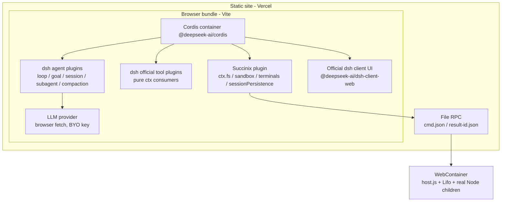

# dsh-zeroweb

**dsh 的纯静态浏览器发行版** — DeepSeek Harness in your browser. No install. No server. Open a URL and go.

> [!IMPORTANT]
> **dsh-zeroweb 是第三方社区移植项目，与 DeepSeek 无关。**
> 基于 MIT 开源的 [deepseek-harness](https://github.com/deepseek-ai/deepseek-harness) 构建，
> 非 DeepSeek 官方产品，未获 DeepSeek 认可或背书。

## What is this

Official DSH Web UI runs as a local Node service (`npx @deepseek-ai/dsh web`, localhost:3080).
dsh-zeroweb removes the Node requirement entirely:

```
Open dsh-zeroweb.vercel.app
  → browser boots a Succinix browser-native Linux sandbox (zero install)
  → dsh agent core runs inside: write code, run commands, serve apps, install packages
  → close the tab when done; data lives in the browser (or export it)
```

- **Zero install** — no Node.js, no CLI, no local daemon
- **Zero server** — pure static hosting (Vercel), all computation in the browser
- **Zero cost** — static hosting is free; you bring your own model API key
- **dsh-native** — official dsh agent engine + official Web UI, synced with upstream
- **Plugin ecosystem** — official dsh plugins and the dsh-web-ui skin/plugin ecosystem
- **Succinix-powered** — browser-native Linux execution world (fs / sandbox / terminals / persistence)

## Architecture



Key seam: official `connection/` (browser-host RPC) is replaced with an in-browser
transport — process-local Cordis ctx + file RPC into Succinix. Everything else in the
official client stack is reused as-is.

## Status

- 2026-08-13: Repository scaffolded. Planning in `docs/PLAN-dsh-zeroweb.md`.
- Pending: M1 POC (dsh agent boot inside browser execution worlds).

## Upstream sync

- Lock `@deepseek-ai/*@0.1.0-rc.6` snapshot, review every two weeks (rc-era releases move fast)
- Renovate upgrade PRs → CI compatibility matrix (official plugins, one by one) → merge on green
- All browser adaptation isolated in the adapter layer — zero upstream package modification

## Non-goals / Boundaries

- Not an official DeepSeek product; no affiliation implied
- Native binaries / real kernel / apt: physically impossible in the browser sandbox
- Firefox / Safari / mobile: WebContainers does not support them (graceful error page)
- Plugins run in the browser main thread — installing third-party plugins means trusting their code with your API keys

## Repos

- Upstream: https://github.com/deepseek-ai/deepseek-harness
- This project: https://github.com/CJackHwang/dsh-zeroweb
- Succinix (execution world): https://github.com/CJackHwang/Succinix
