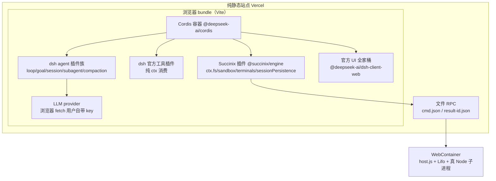

# PLAN: DSH-Zero — dsh 纯静态浏览器移植（v1.0）

> **Status**: 执行基线（2026-08-13 仓库已初始化）
> **执行者**: AI agent（用户派 CC）+ 技术团队。审阅者: Hermes（沈知夏）。
> **前置**: Succinix 0.6.0（S0-S3，`~/Desktop/MyProject/Succinix/docs/PLAN-dsh-native.md`）提供 dsh 标准服务面；官方 dsh 锁 0.1.0-rc.6。
> **权威依据**: dsh 官方仓库 + npm 发布物（全部实测存在 2026-08-13）

---

## 0. 战略定位（一句话）

**DSH-Zero = dsh 的纯静态浏览器发行版**：官方 dsh Web UI（client 包全家桶，MIT）+ dsh agent 核心 + Succinix 浏览器原生 Linux 执行世界，纯静态部署、零安装零服务器、打开即用，随官方上游同步，兼容 dsh 插件生态。**非官方第三方移植**（README 头行声明）。

## 1. 已决策（用户拍板，勿回退）

1. **前端 = 官方全套复用**：`@deepseek-ai/dsh-client-web` 全家桶（React UI 组件库 + shell + 模块系统），`apps/web` 只是 10 行薄壳——不自己写 UI。白拿官方维护 + dsh-web-ui 生态（ui-slots 插槽系统）。
2. **唯一接缝 = connection 层**：官方 `connection/`（browser-host RPC）默认连本地 Node host（localhost:3080）→ 替换为浏览器内传输（进程内 Cordis ctx + 文件 RPC → Succinix）。
3. **执行世界 = Succinix**：`ctx.fs` / `ctx.sandbox` / `ctx.terminals` / `ctx.sessionPersistence` 由 Succinix 提供（依赖 0.6.0 S0-S3；0.5.0 的 `ctx.succinix.*` 可作临时适配）。
4. **agent 核心 = dsh 官方包**：36 包闭包（agent-loop/goal/session/subagent/compaction），纯逻辑，唯一 Node 依赖 node:crypto → webcrypto shim。同步 = npm 版本升级（锁 rc.6 + 每两周复核）。
5. **纯静态部署**：Vercel（COOP/COEP 头，参考 SunamAI 已验证配置）。零服务器。
6. **插件三层**：内置（构建期打包）/ 市场（运行时 CDN，esm.sh）+ 热装 / WC 可选（真 npm install）。
7. **主题插件 = 项目特色（2026-08-13 拍板）**：`@dsh-zero/theme`（client 插件，走官方 ui-theme/ui-slots 扩展点），**深浅双模式全量适配**（light/dark 两套 `--dsw-alias-*` token 全覆盖，官方 ThemeRuntime 三态管理照用）；视觉 = 琥珀暖色家族（与 Succinix 执行层同族：dark 黑 #0a0a0a + 琥珀橙 #c2702a + 暖白 #d6cfc4；light 暖米纸色 + 深暖墨 + 深琥珀强调，**浅色也是暖色系**，与官方冷白区分）；移动端响应式覆盖（<768px 单栏 + 抽屉）；克制动画（View Transitions + prefers-reduced-motion 尊重）。官方已知限制：第三方主题 override 无完整性校验 → 必须枚举 token 全量覆盖，漏一个残留官方色。
8. **单轨铁律**：不维护双套 API。dsh 官方服务键 = 唯一命名空间。

## 2. 架构

官方机制复用清单（全部实测存在）：
- `@deepseek-ai/dsh-client-modules`：浏览器端模块系统（lazy CJS table），**internal 契约可替换**——"replacing `internal` replaces exactly 'how plugin code arrives' and nothing else"。插件代码到达方式 = DSH-Zero 唯一要实现的浏览器加载路径。
- `@deepseek-ai/dsh-client-hmr`：热更新链（invalidate → prefetch → registry.delete → drain → refresh → remount），依赖者经 Cordis epoch 级联。
- boot graph（`window.__DSH_BOOT__`）：构建期生成启用插件清单 + bundle 哈希。
- `ui-settings-plugins` / `ui-settings-plugin-inventory`：官方插件管理 UI。

## 3. 参考资源（2026-08-13 全部实测存在）

1. 官方仓库: https://github.com/deepseek-ai/deepseek-harness （默认分支 **master**）
2. 官方 Web UI 薄壳: https://github.com/deepseek-ai/deepseek-harness/tree/master/apps/web （`@deepseek-ai/dsh-web-frontend`，Vite + React 18，`vite build` 纯静态；`src/main.ts` 10 行；`src/node-module-stub.ts` 官方浏览器 stub 先例）
3. 官方 client 全家桶: https://github.com/deepseek-ai/deepseek-harness/tree/master/packages/client （`@deepseek-ai/dsh-client-*`：web / modules / web-react / connection / runtime / hmr / locale / schema-form / ui-* 全系列；**connection/README.md 是接缝文档**）
4. 官方 Web UI 启动与指南: 仓库内 `docs/user/guide/index.md`（`npx @deepseek-ai/dsh web` → localhost:3080）
5. npm 发布物（锁 0.1.0-rc.6）: `@deepseek-ai/dsh-web-frontend`、`@deepseek-ai/dsh-client-web`、`@deepseek-ai/dsh-client-modules`、`@deepseek-ai/dsh-client-hmr`、`@deepseek-ai/dsh-agent`、`@deepseek-ai/dsh-agent-loop`、`@deepseek-ai/cordis`
6. 插件解剖样例（纯 ctx 消费范式）: npm `@deepseek-ai/dsh-tool-fs`（只调 ctx.tools/ctx.fs/ctx.systemPrompt/ctx.approval）
7. 社区 UI 生态（复用目标）: https://github.com/zhu1090093659/dsh-web-ui （294★，任务看板/git 图谱/皮肤中心，走官方 ui-slots）
8. Succinix 服务面对齐计划（前置依赖）: `~/Desktop/MyProject/Succinix/docs/PLAN-dsh-native.md`（S0-S3：ctx.succinix.* → ctx.fs/sandbox/terminals/sessionPersistence）
9. SunamAI 侧 dsh 对齐计划（姊妹计划）: `~/Desktop/MyProject/SunamAI/docs/PLAN-dsh-web.md`（A0-A3；fork 同步策略、webcrypto shim、npm alias 全链路）
10. Succinix 开发细节: `~/Desktop/MyProject/Succinix/docs/SDK.md`、AGENTS.md（文件 RPC 协议、TerminalExecutor 路由、快照持久化、门禁命令）

## 4. 里程碑（顺序 TASK 表，无时间排程）

### M0: 仓库基线 ✅（已由 Hermes 完成）
- 仓库初始化、README（非官方声明）、.gitignore、package.json（pnpm workspace 骨架）
- 门禁: `git log` 干净、README 非官方声明在头行

### M1: POC 验证命脉（四个验证点，可并行，全部要真实执行）
- **M1a** WC 内 dsh boot: 在 WebContainer 沙箱（Succinix 环境或最小复现）`npm i @deepseek-ai/dsh@0.1.0-rc.6` → boot agent loop → 真实跑一轮对话 + 工具调用。门禁: agent 响应 + 工具结果真实返回。
- **M1b** 零 WC 下限: 浏览器 bundle 内 Cordis（@deepseek-ai/cordis）+ dsh agent 36 包 + webcrypto shim，ctx 实现接 OPFS/Lifo（不 boot WebContainer）。门禁: 一轮对话 + 一次 fs 工具调用走 OPFS。
- **M1c** 官方模块加载器纯静态加载: `ClientModuleLoader` + 官方插件 tsdown 构建的 `.client.js` bundle，在纯静态页面加载并注册（不走 Node host `/plugins`）。门禁: 插件 factory 注册 + materialize 成功，boot graph 自举。
- **M1d** 市场层 CDN: esm.sh `?cjs` 产物能否被 `ClientModuleLoader` 消费。门禁: 远程 bundle 注册 + materialize。
- 另验: DeepSeek API 浏览器直连 CORS 头（不行则记代理方案）。

### M2: 装配（依赖 M1 至少一条命脉 + Succinix 0.6.0）
- connection 实现替换（浏览器内传输）、agent 宿主适配、Succinix 服务面接线、boot graph 生成脚本
- 门禁: 官方 UI 完整渲染 + dsh agent 在 Succinix 环境跑通杀手场景（写文件 → 跑命令 → 起服务 → 预览）

### M2.5: 主题插件（项目特色，可与 M2 并行）
- **T-THEME**: `@dsh-zero/theme` client 插件骨架（官方 client 插件形态: exports["./client"] + apply/inject + ui-slots register）。**枚举官方 5 个 token sheet（base/design-platform/scrollbar/gradient-shadow-text/shiki）全量 `--dsw-*` 清单** → 深浅两套全量 override → 琥珀暖色家族（dark: #0a0a0a/#c2702a/#d6cfc4；light: 暖米纸 + 深暖墨 + 深琥珀强调，light 下琥珀橙须满足 WCAG 对比度）。门禁: 深浅切换无残留官方色（逐 token diff）
- **T-MOBILE**: <768px 响应式覆盖（sidebar → 抽屉、details → 全屏/底部抽屉、conversation 全宽、触控 ≥44px、safe-area-inset、theme-color 跟随）。前置: 抓官方 AppFrame 真实 DOM 结构确认稳定（POC 验证点）。门禁: 375px 视口实测布局完整可用
- **T-MOTION**: View Transitions API 面板/页面过渡 + 消息进入动画 + hover 微反馈；尊重 prefers-reduced-motion。门禁: 动画开关可全局禁用、无闪烁
- 发布形态: 内置层随站打包 + npm 发布（第三方 dsh web 用户可装）

### M3: 发布
- Vercel 静态部署（COOP/COEP）、README 完善、非官方声明、CI（兼容矩阵 + Renovate）
- 门禁: 线上 URL 打开即用、官方插件 10+ 兼容矩阵 ✅/⚠️/❌

## 5. 门禁与纪律

- 浏览器运行时验证必须真实执行（headless Chrome + 真 WebContainer + 真命令，不许 mock）
- 禁 emoji/绿色扫描: `grep -rn '✅\|❌\|🎉\|GREEN' src/ index.html`
- tsc 0 错 / build 成功 / lint 0
- 参考地址写进 TASK 规格（本文 §3），CC 无对话记忆，地址是唯一路标
- 每次同步上游后重跑兼容矩阵

## 6. 边界与安全模型（写规格必带）

- 插件跑浏览器主线程 → 能读 API key、能碰 DOM。市场插件 = 显式信任 + 来源标识 + 版本锁定 + integrity；插件权限声明 v1 先做"安装确认"，复杂权限后置
- 真内核/apt/原生二进制: 沙箱物理边界，不做
- Firefox/Safari/移动端: WebContainers 不支持，错误页说明
- 交互式 stdin: WC 不可靠，文件 RPC 替代（Succinix 已验证）
- 上游 rc 期火箭发布: 锁 rc.6，1.0.0 前不主动追，每两周复核

## 7. 大方向（写任何 TASK 都要带）

- **单轨**: 命名空间 100% 对齐 dsh 官方服务键，自研键全灭；不维护双套 API
- **复用优先**: 官方 client 全家桶、Loader、HMR、UI 全部白拿，只写"代码到达方式"和 connection 传输
- **Succinix 是执行世界本体**: 浏览器 fs/sandbox/terminals 的唯一提供者（护城河），不做第二个执行层
- **纯静态是硬约束**: 任何需要服务器的设计都是错误方向
